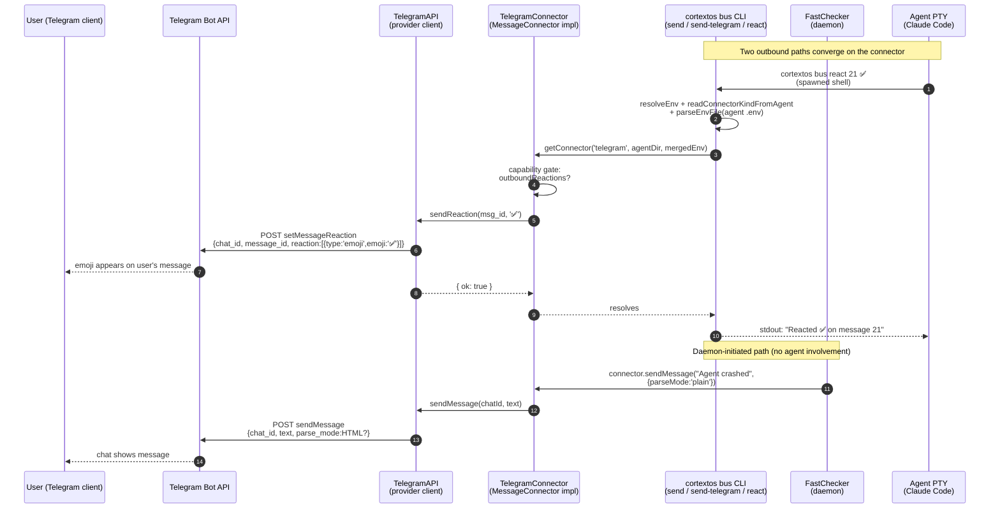
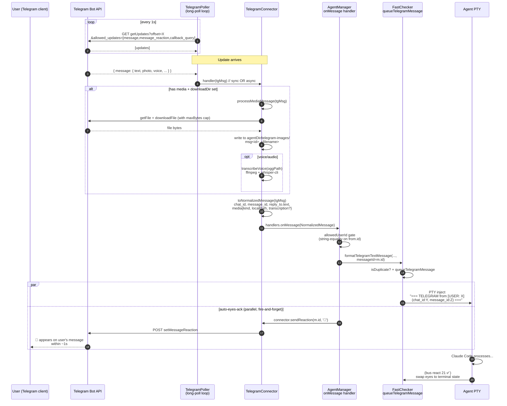
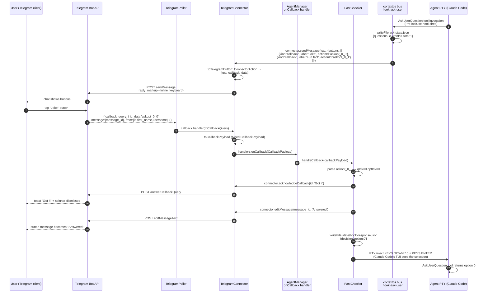
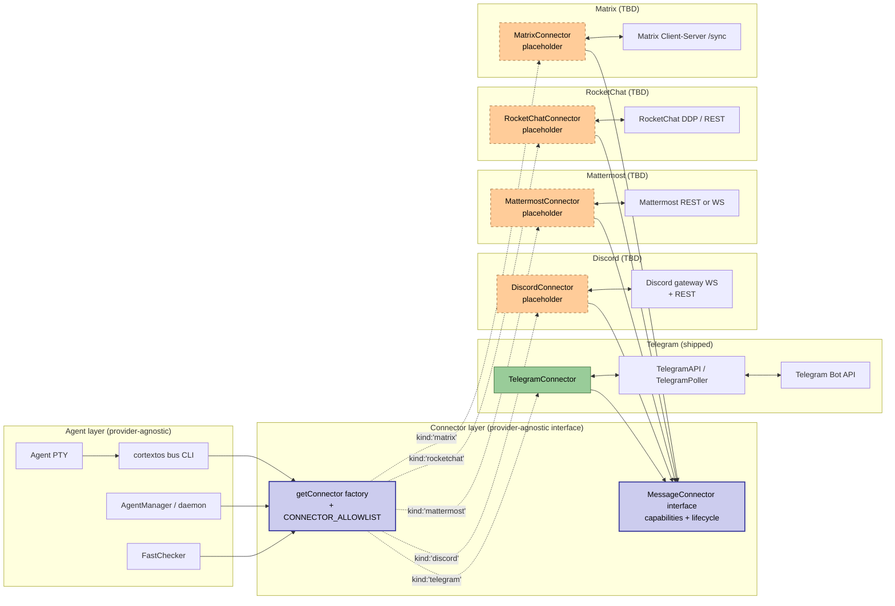
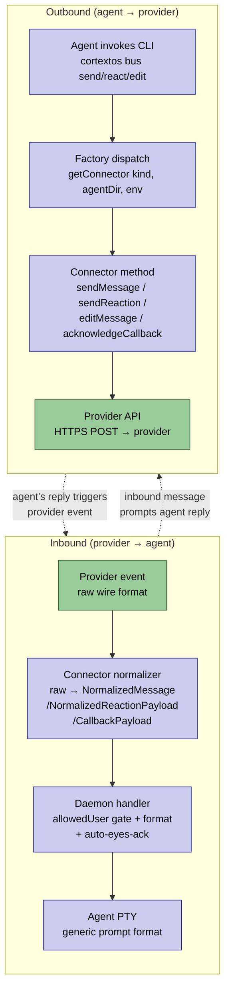

# Connector data flow diagrams

Companion to `docs/architecture/connectors.md`. Shows every call path
between the agent's PTY, the bus CLI, the pluggable connector layer,
and the external messaging provider (Telegram today; Discord /
Mattermost / RocketChat / Matrix shown as the same shape).

The diagrams use Telegram as the concrete provider because it's the
only one implemented. To see how a future provider plugs in, mentally
substitute the orange "Provider boundary" box with the target's
client. The provider-agnostic boxes (everything between agent and
boundary) don't change.

---

## 1. Outbound flow — agent sends a message / reaction

**Key seams** (orange = provider boundary, blue = generic):

- `cortextos bus react`, `bus send`, `bus send-telegram` are all generic
  CLI surfaces — they all route through `getConnector()`.
- `getConnector(kind, agentDir, env)` is the dispatch point. Replacing
  the `'telegram'` literal with `'discord'` (or `'matrix'`, etc.)
  swaps the TelegramConnector box for the future provider's
  connector, and the rest of the diagram is unchanged.
- The daemon's crash-notification path bypasses the CLI entirely —
  it holds a connector reference from `startAgent` time and calls
  `connector.sendMessage` directly.

---

## 2. Inbound flow — Telegram message reaches the agent

---

## 3. Callback round-trip — inline buttons (AskUserQuestion path)

---

## 4. Pluggability — same diagrams, different provider

**Legend:**
- Solid blue boxes (`MessageConnector`, `getConnector`) — provider-agnostic interface points. These are the load-bearing seams; everything below them is swappable.
- Green box (`TelegramConnector`) — the only implementation shipped today.
- Dashed orange boxes — placeholder connectors. Each lands as a single
  PR per the §13 checklist (13-15 files touched, no interface
  changes required).

Adding a new connector means adding **one orange box + edge** to this
diagram. No edge above the connector layer needs to change.

---

## 5. Bidirectional summary — what the connector layer guarantees

The four blue boxes on each side (i2/i3/i4/o1, o2/o3) are
provider-agnostic and stay byte-identical across all connectors.
Only the two green endpoints (i1 raw provider event, o4 provider
API) are provider-specific — and those live inside the
connector's own directory under `src/connectors/<kind>/`.
