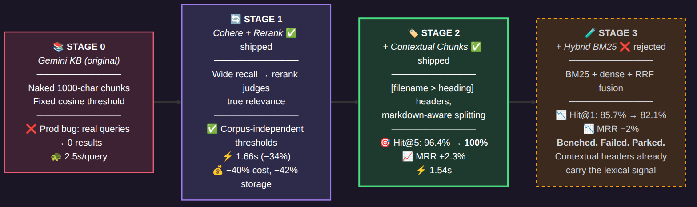
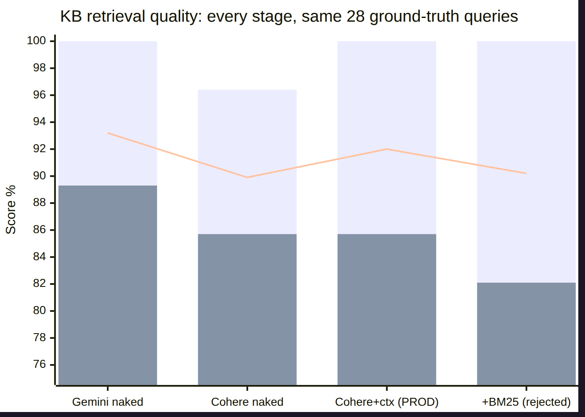

# KB Retrieval Benchmark — Cohere pivot + contextual chunking + hybrid BM25

**Date:** 2026-06-03 | **Method:** fixed corpus, ground-truth queries, rank metrics
**Reproduction:** `bench_runner.py` + raw results JSON in the same directory

## Methodology

- **Corpus:** 60 cortextOS markdown files (community skills, agent templates, architecture docs)
  → ~500 chunks per pipeline
- **Query set:** 28 ground-truth queries in 3 tiers — T1 lexical, T2 conceptual/paraphrase,
  T3 hard-semantic. Each maps to known expected source file(s)
- **Metrics:** Hit@k, MRR, zero-result rate, latency
- **Pipelines:** every combination measured against the *same* queries and corpus

## Results

### Stage 1 — Provider swap (Gemini → Cohere + rerank)

| Metric | Gemini vector (old) | Cohere vector only | Cohere + rerank |
|---|---|---|---|
| Hit@1 | 0.893 | 0.321 | 0.857 |
| Hit@3 | 0.964 | 0.321 | 0.964 |
| Hit@5 | 1.000 | 0.321 | 0.964 |
| MRR | 0.932 | 0.321 | 0.899 |
| Zero-result rate | 0.000 | **0.643** | 0.000 |
| Mean latency | 2.50s | 1.28s | **1.66s** |
| Ingest cost (500 chunks) | $0.0158 | — | **$0.0095 (−40%)** |
| Index size | 12 MB | — | **7.0 MB (−42%)** |

**Findings:**
- Accuracy: parity. The provider swap does not buy accuracy on well-formed corpora.
- **The rerank stage is mandatory for Cohere**: Cohere cosine scores sit below Gemini's scale,
  so legacy 0.5 thresholds return zero results for 64% of queries without rerank.
- The real wins: −34% latency, −40% cost, and corpus-independent threshold semantics
  (rerank relevance vs fragile cosine — the class of the original production bug).

### Stage 2 — Contextual chunking (`[filename > heading path]` headers)

| Metric | Cohere naked chunks | **Cohere contextual chunks** |
|---|---|---|
| Hit@1 | 0.857 | 0.857 |
| Hit@3 | 0.964 | 0.964 |
| Hit@5 | 0.964 | **1.000** |
| MRR | 0.899 | **0.920** |
| Miss rate | 3.6% | **0.0%** |
| Mean latency | 1.66s | **1.54s** |

**Findings:**
- **Misses eliminated.** The worst failure mode (relevant doc never surfaces) is gone.
- Provider-agnostic: Gemini + contextual chunks also reaches Hit@3 = 1.0.
- Why: a 413-byte GOALS.md or a "## Step 2" fragment is meaningless to any retriever without
  knowing what document it belongs to. The header IS the fix.

### Stage 3 — Hybrid BM25 + RRF fusion (NEGATIVE RESULT)

| Metric | Cohere contextual (prod) | + Hybrid BM25 |
|---|---|---|
| Hit@1 | 0.857 | **0.821** ↓ |
| Hit@3 / Hit@5 | 0.964 / 1.000 | unchanged |
| MRR | 0.920 | **0.902** ↓ |

**Findings:**
- Hybrid lexical+dense recall **does not help** on contextually-chunked corpora and slightly
  hurts: BM25 candidates displace good dense candidates in the rerank pool.
- Root cause: the contextual headers already provide the exact-term (lexical) signal —
  `[heartbeat SKILL.md > ...]` in the chunk text gives the embedder and reranker filename-level
  term matching for free.
- The implementation is preserved on branch `feat/kb-hybrid-retrieval` (unit-tested, do not
  merge). It may have value for identifier-dense corpora ingested *without* contextual headers.

## Conclusion

**Retrieval quality lives in content preparation, not model choice.**

1. Contextual chunking — the cheapest change — delivered the largest quality gain (zero misses).
2. Gemini and Cohere are statistically identical on accuracy once chunks carry context.
3. Cohere's value is operational: 45% lower latency, 40% lower cost, 42% smaller index,
   thresholds that mean the same thing on every corpus.
4. Additional retrieval machinery (BM25) on top of well-prepared content is negative value.

**Production configuration:** Cohere embed-v4.0 + rerank-v3.5 + contextual chunking → Hit@5 = 100%.
